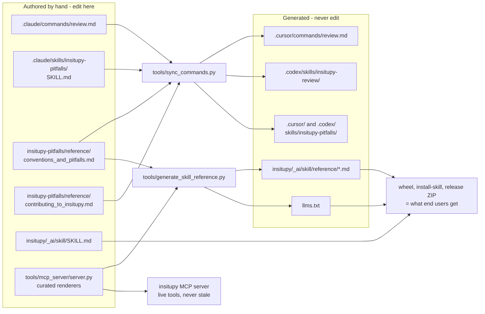

# Contributing to InSituPy

Thanks for your interest in improving InSituPy! Contributions of all kinds are welcome: bug
reports, feature ideas, documentation, and code.

InSituPy is a Python framework for histology-guided, multi-sample analysis of single-cell spatial
transcriptomics data. It is under active development and maintained by a small team, so a little
structure goes a long way.

## Ways to contribute

- **Report a bug or request a feature:** open an
  [issue](https://github.com/SpatialPathology/InSituPy/issues).
- **Ask a question / discuss:** join our [Zulip chat](https://insitupy.zulipchat.com).
- **Contribute code or docs:** open a pull request (see below).

## Development setup

InSituPy requires Python >= 3.12 (>= 3.13 if you use the SpatialData integration).

```bash
# 1. Fork and clone
git clone https://github.com/<your-user>/InSituPy.git
cd InSituPy

# 2. Create an environment (conda shown; venv/uv are fine too)
conda create --name insitupy-dev python=3.13
conda activate insitupy-dev

# 3. Editable install with development dependencies
pip install -e ".[dev]"
```

Optional extras: `.[mcp]` (the AI MCP server), `.[spatialdata]` (SpatialData support). Combine as
needed, e.g. `pip install -e ".[dev,mcp]"`.

## Running tests and linting

```bash
# Run the test suite (or a targeted file while iterating)
pytest
pytest tests/test_<area>.py

# Lint and format the files you changed (ruff is configured in pyproject.toml)
ruff format path/to/changed_file.py
ruff check path/to/changed_file.py
```

Notes:

- **Lint the files you touched, and don't introduce new violations.** The codebase currently
  carries pre-existing ruff findings that are being cleaned up separately, so a repo-wide
  `ruff check` is not yet clean - don't be alarmed by unrelated findings, just keep your own
  changes clean.
- Prefer running the **targeted** test files for the area you changed while iterating; the full
  suite is slow.
- Some napari/Qt tests may fail in a headless environment for reasons unrelated to your change -
  mention it in your PR if you hit those.

## AI-assisted contributions

Using an AI assistant is encouraged, but it comes with responsibilities. **Please read
[AI_POLICY.md](AI_POLICY.md) before submitting AI-assisted work.** In short:

- You are fully responsible for everything you submit and must understand it.
- Before opening a PR, run an AI-assisted review over your changes and **paste a short summary of
  what it found into the PR**. The project provides a `/review` workflow (a self-contained InSituPy
  review command usable from a fresh clone across common AI coding agents) to standardize this.
- To help your assistant write correct InSituPy code, point it at the InSituPy **skill**
  (easiest - `insitupy install-skill` after `pip install insitupy-spatial`) or the **MCP server**
  (power users). See the [README](README.md#ai-assistant-integration-skill).

### In-repo AI dev-workflow

This repo ships an AI-assistant workflow so any contributor can use it on a fresh clone. The one
required piece is a pre-PR review; the pitfalls knowledge is shared as a portable skill.

- **Review before every PR (required by [AI_POLICY.md](AI_POLICY.md)).** Run the review over your
  changes and paste the summary it prints into your PR.
    - **Claude Code:** `/review` (`.claude/commands/review.md`).
    - **Cursor:** `/review` (`.cursor/commands/review.md`; Cursor >= 1.6).
    - **Codex:** the `insitupy-review` skill (`.codex/skills/insitupy-review/`; invoke it
      explicitly). The Codex path is not yet verified end-to-end - feedback is welcome.
  All three ship with the clone and need no separate install (your agent must support the
  relevant command or skill mechanism).
- **InSituPy pitfalls skill** - catches non-obvious API traps. It is provided as a skill in Claude
  Code (`.claude/skills/insitupy-pitfalls/`), Cursor (`.cursor/skills/insitupy-pitfalls/`; Cursor
  >= 2.4), and Codex (`.codex/skills/insitupy-pitfalls/`). Skill auto-loading has only been
  partially tested (mainly in Claude Code); the Cursor and Codex paths are best-effort and
  feedback is welcome. On any agent, the review workflow also reads the underlying files
  (`.claude/skills/insitupy-pitfalls/reference/conventions_and_pitfalls.md` and
  `contributing_to_insitupy.md`) directly, so the checklist still applies even without skill
  support.
- **`/plan` and `/implement`** are Claude Code-only, maintainer-oriented, and optional; they are
  not mirrored to other agents.
- **Single source of truth.** The review workflow and the pitfalls skill are authored once under
  `.claude/` and rendered into the Cursor/Codex directories by `tools/sync_commands.py`. If you
  change either, re-run `python tools/sync_commands.py` and commit the regenerated files.
- If the `insitupy` MCP server is available, the review prefers its live tools; otherwise it
  verifies against the checked-out source.
- **Maintainers only - bumping the version:** after updating the version, run
  `python tools/generate_skill_reference.py` and commit the refreshed
  `insitupy/_ai/skill/reference/*.md`, `SKILL.md` version stamp, and `llms.txt`, so the committed
  tree (and anything installed via `insitupy install-skill` from a source checkout) doesn't lag
  the release. `release.yml` regenerates the same files on tag as a belt-and-suspenders step.

#### Which files are canonical, and which are generated

Every file on the right is overwritten by a generator. Edit the boxes on the left, re-run the
generator in the middle, and commit the result. Editing a generated file directly is always lost
on the next run.



Two things the diagram is there to make obvious:

- **`conventions_and_pitfalls.md` has two consumers.** `sync_commands.py` mirrors it to
  Cursor/Codex *and* `generate_skill_reference.py` copies it into the shipped skill. A change
  there reaches end users, so keep it free of repo-only material.
- **`contributing_to_insitupy.md` has one.** It reaches the agent mirrors and stops. Repo-only
  material - `tests/` paths, `git` commands, MCP tool names - belongs there, never in its sibling.

One exception the diagram deliberately simplifies: `insitupy/_ai/skill/SKILL.md` is hand-written
prose, but `generate_skill_reference.py` also rewrites its frontmatter `version:` line. It is the
only file that is both authored and machine-touched, so edit its body freely and leave that one
line to the generator.

## Pull request checklist

1. Branch from the appropriate base branch and keep changes focused.
2. Tests pass (`pytest`), and `ruff check` / `ruff format` on the files you changed report no
   new issues.
3. If you changed any dependency in `pyproject.toml`, run `poetry lock` and commit the updated
   `poetry.lock` in the same commit - CI checks that the two stay in sync.
4. Add or update tests for the behavior you changed.
5. If you used AI, follow [AI_POLICY.md](AI_POLICY.md) and include the AI-review summary.
6. Describe **what** changed and **why** in the PR description.

## License

By contributing, you agree that your contributions are licensed under the project's
[BSD-3-Clause](LICENSE) license.