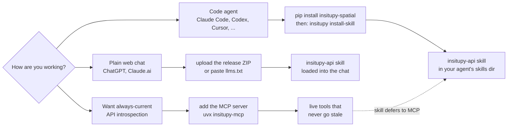

[](https://doi.org/10.5281/zenodo.18459472) [](https://deepwiki.com/SpatialPathology/InSituPy)

# InSituPy: A framework for histology-guided, multi-sample analysis of single-cell spatial transcriptomics data

<p align="center">
   
</p>

InSituPy is a Python package designed to facilitate the analysis of single-cell spatial transcriptomics data. With InSituPy, you can easily load, visualize, and analyze the data, enabling and simplifying the comprehensive exploration of spatial gene expression patterns within tissue sections and across multiple samples.
Currently the analysis is focused on data from the [_Xenium In Situ_](https://www.10xgenomics.com/platforms/xenium) methodology. Readers for [Visium](https://www.10xgenomics.com/platforms/visium) and [QuPath](https://qupath.github.io/) data are available as well, as is conversion to and from [SpatialData](https://spatialdata.scverse.org).

## Latest changes

InSituPy 0.12 is the current stable release. It adds filter layers and a cross-sample table workflow for `InSituExperiment`, multiple cell and spatial-unit layers, SpatialData conversion, AI-assistant integration and a safer save pipeline. Some analysis defaults changed in 0.12, so check the release notes when upgrading from 0.11.

For all changes check out the [releases](https://github.com/SpatialPathology/InSituPy/releases). If an update breaks your workflow, please [open an issue](https://github.com/SpatialPathology/InSituPy/issues) or contact us via our [zulip chat](https://insitupy.zulipchat.com).

## Getting started

### Overall data structure

InSituPy keeps everything that belongs to a tissue section in one place and organises many sections into one study:

- `InSituData`: one sample. It integrates all modalities of a spatial omics dataset: cells (gene counts and boundaries), images, transcripts, annotations, regions and units (e.g. Visium spots or niches).
- `InSituExperiment`: aggregates multiple `InSituData` instances and links them with a sample table (metadata), enabling cross-sample analysis.

<p align="center">
   
</p>

New to InSituPy? Read [InSituPy at a glance](https://insitupy.readthedocs.io/en/latest/overview.html) for a plain-language introduction to this structure.

### Installation

Make sure you have Conda installed on your system before proceeding with these steps. If not, you can install Miniconda or Anaconda from [https://docs.conda.io/en/latest/miniconda.html](https://docs.conda.io/en/latest/miniconda.html).

**Create and activate a conda environment:**

InSituPy requires Python 3.12 or newer (also with SpatialData support).

   ```bash
   conda create --name insitupy python=3.13
   conda activate insitupy
   ```

**Install from PyPI:**

   ```bash
   pip install insitupy-spatial
   ```

This base installation includes napari and related visualization dependencies.

InSituPy currently requires `zarr>=3.2.1` and targets the zarr v3 format. Legacy zarr v2 workflows are only partially supported and not tested.

**Optional: install with SpatialData support (`spatialdata>=0.8.0,<0.9.0`):**

   ```bash
   pip install insitupy-spatial[spatialdata]
   ```

To ensure that the InSituPy package is available as a kernel in Jupyter notebooks within your conda environment, you can follow the instructions [here](https://ipython.readthedocs.io/en/stable/install/kernel_install.html).

For alternative installation strategies see the [documentation](https://insitupy.readthedocs.io/en/latest/installation.html).

### Quick start

```python
import insitupy as ispy

xd = ispy.io.read_xenium("path/to/xenium_output")   # read one Xenium run
ispy.pp.normalize_and_transform(xd)
ispy.pp.reduce_dimensions(xd)
ispy.pp.cluster_cells(xd)
xd.show()                                           # interactive viewer (napari)
```

The [tutorials](https://insitupy.readthedocs.io/en/latest/tutorials/index.html) walk through this step by step with demo data.

### Documentation

For detailed instructions on using InSituPy, refer to the [official documentation](https://InSituPy.readthedocs.io).

InSituPy works best within *Jupyter Lab* or *Jupyter Notebook* sessions. If you are not familiar with these platforms, see the documentation of [Project Jupyter](https://jupyter.org/).

<!-- ai-integration-start -->

### AI Assistant Integration

#### Which integration should I use?

InSituPy ships two complementary integrations: a **skill** (a static reference any assistant can
load, versioned per release) and an **MCP server** (live introspection against the installed
source). Pick by how you work - they cooperate rather than compete.



#### Skill

**Easiest option:** install the InSituPy skill (`insitupy-api`). It teaches any AI assistant - a coding agent or
plain web chat - the data model, the typical read -> preprocess -> tools -> plot -> save
workflow, and where to look for detailed API references, so it writes correct InSituPy code
without guessing from memory. No server, no setup beyond installing the package.

- **Code agents** (Claude Code, Codex, Cursor, ...): after `pip install insitupy-spatial`, run

  ```bash
  insitupy install-skill
  ```

  This copies the skill to `./.agents/skills/insitupy-api/` by default; pass `--target
  {claude,codex,cursor}` or `--path DIR` to install elsewhere, and `--force` to upgrade an
  existing copy.
- **Plain web chat** (ChatGPT, Claude.ai, no skill loader): either paste the contents of the
  repo-root [`llms.txt`](https://github.com/SpatialPathology/InSituPy/blob/main/llms.txt) (or its
  raw URL) into the chat/project knowledge, or upload
  the `insitupy-api-<version>.zip` asset attached to the
  [latest release](https://github.com/SpatialPathology/InSituPy/releases/latest).

The skill is versioned and self-upgrading: if it's missing something you expect, check your
installed `insitupy.__version__` against the skill's stamped version and re-run `insitupy
install-skill --force` (or re-fetch the ZIP/`llms.txt`) if it's out of date.

If the `insitupy` MCP server (below) is also available in your session, an agent following the
skill will prefer its live tools automatically - the skill is a fallback, not a competing source.

#### MCP Server

For power users who want live, always-current introspection (not just a static reference),
InSituPy also ships an [MCP](https://modelcontextprotocol.io) server that gives AI assistants live access to the API, source code, and workflow examples. Because it is a standard MCP server (stdio), it works with any MCP-compatible client, such as **Claude Desktop**, **Claude Code**, **Cursor**, **Codex**, **Windsurf**, **Continue.dev**, or **Cline**. Setup has mainly been exercised with Claude Desktop and Claude Code; if you use it with another client, feedback is welcome.

The easiest way to activate the server in **Claude Desktop** is to add the following to your `claude_desktop_config.json` - no separate installation or repository clone required:

```json
{
  "mcpServers": {
    "insitupy": {
      "command": "uvx",
      "args": ["--python", "3.12", "--from", "insitupy-spatial[mcp]", "insitupy-mcp"]
    }
  }
}
```

`uvx` (part of [uv](https://docs.astral.sh/uv/)) handles downloading and running the server automatically in an isolated environment. Install `uv` first if you haven't already (`curl -LsSf https://astral.sh/uv/install.sh | sh` on macOS/Linux, `winget install --id=astral-sh.uv -e` on Windows, or see [installation options](https://docs.astral.sh/uv/getting-started/installation/)).

See **[MCP_TUTORIAL.md](https://github.com/SpatialPathology/InSituPy/blob/main/MCP_TUTORIAL.md)** for step-by-step setup instructions (Claude Desktop and Codex; other clients use the same stdio command in their own MCP config).

<!-- ai-integration-end -->

## Features

- **Data storage**: Store data on both the single sample level and the multi-sample level using the `InSituData` and `InSituExperiment` objects.
- **Data Preprocessing:** InSituPy provides functions for normalizing, filtering, and transforming raw in situ transcriptomics data.
- **Interactive Visualization:** Create interactive plots using [napari](https://napari.org/stable/#) to easily explore spatial gene expression patterns.
- **Annotation:** Annotate _Xenium In Situ_ data in the napari viewer or import annotations from external tools like [QuPath](https://qupath.github.io/).
- **Multi-sample analysis:** Perform analysis on an experiment-level, i.e. with multiple samples at once.
- **Sample selection and cross-sample tables:** Define named sample subsets with filter layers, and combine the cell tables of all samples into one AnnData (`build_table()`) for joint analysis, with results written back to the individual samples.
- **Multiple segmentations:** Keep several cell and spatial-unit layers (e.g. different segmentations, Visium spots or niches) side by side in one dataset.
- **SpatialData conversion:** Convert to and from [SpatialData](https://spatialdata.scverse.org) to use tools of the scverse ecosystem.
- **AI-assistant integration:** A shipped skill and an MCP server help AI assistants write correct InSituPy code (see above).

## QuPath

We try to develop InSituPy alongside the Bioimage Analysis tool [QuPath](https://qupath.github.io). QuPath has great functionalities to visualize whole slide image data, add annotations, generate segmentations or analyze signal intensities. We collect scripts that simplify the connection between QuPath and InSituPy [here](https://github.com/SpatialPathology/InSituPy-QuPath). This includes:
- Export of annotations as GEOJSON from QuPath
- Export of images as OME-TIFF from QuPath
- Collected export of data from a multiplexed IF image to be imported into InSituPy. Import can be performed using either `read_qupath` or `read_qupath_project`. For cell and nucleus segmentation of multiplexed IF images we recommend using [Instanseg](https://github.com/instanseg/instanseg).

## Contributing

Contributions are welcome! If you find any issues or have suggestions for new features, please open an [issue](https://github.com/SpatialPathology/InSituPy/issues), submit a pull request or contact us via our [zulip chat](https://insitupy.zulipchat.com).

Before opening a pull request, please read the [Contributing Guide](CONTRIBUTING.md) and, if you used an AI assistant, the [AI Policy](AI_POLICY.md). The repo also ships an [in-repo AI dev-workflow](CONTRIBUTING.md#in-repo-ai-dev-workflow) (`/review`, `/plan`/`/plan-opus`/`/plan-fable`, `/implement`) usable across common AI coding agents.

## Citation

If you use `InSituPy` in your work, please cite the [publication](https://doi.org/10.1093/bioinformatics/btag073) as follows:

> Wirth, Johannes, Anna Chernysheva, Birthe Lemke, Isabel Giray, and Katja Steiger. InSituPy: a framework for histology-guided, multi-sample analysis of single-cell spatial omics data. <br>
*Bioinformatics* 42(3), 2026. https://doi.org/10.1093/bioinformatics/btag073

## License

InSituPy is licensed under the [BSD-3-Clause](LICENSE).

---

**InSituPy** is developed and maintained by [Johannes Wirth](https://github.com/jwrth) and [Anna Chernysheva](https://github.com/annachernysheva179). Feedback is highly appreciated and hopefully **InSituPy** helps you with your analysis of spatial transcriptomics data. The package is thought to be a starting point to simplify the analysis of in situ sequencing data in Python and it would be exciting to integrate functionalities for larger and more comprehensive data structures. Currently, the framework focuses on the analysis of _Xenium In Situ_ data but it is planned to integrate more methodologies and any support on this is highly welcomed.
