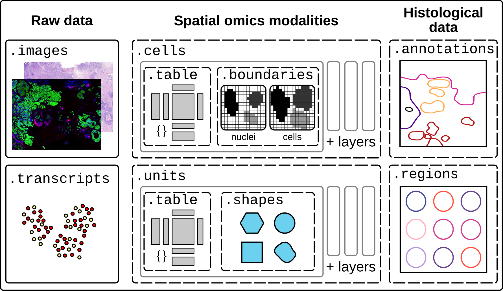

# Single-Sample Analysis

This section provides a comprehensive guide to analyzing individual spatial transcriptomics samples using InSituPy's **`InSituData`** class. The tutorials cover the complete workflow from data preparation through advanced spatial analysis.

<center></center>

## Tutorials

The tutorials are organized into two stages: **Setup & Preparation** and **Core Analysis Workflows**. The individual tutorials build on each other, making it necessary to run them sequentially starting with the tutorial "01: Automated Image Registration".

### Setup & Preparation

Follow these tutorials to learn how to download demo datasets and register histological images to the spatial omics data.

```{eval-rst}
.. card:: 00: Download Demo Datasets
    :link: 00_InSituPy_demo_datasets
    :link-type: doc
    :link-alt: Download demo datasets

    Download example datasets to follow along with the tutorials. Includes 10x Xenium mouse brain data and other sample datasets.

.. card:: 01: Automated Image Registration
    :link: 01_InSituPy_demo_register_images
    :link-type: doc
    :link-alt: Automated image registration

    Register histological (H&E) or immunofluorescence images to your spatial transcriptomics data using automated alignment.
```

### Core Analysis Workflows

Follow these tutorials sequentially to learn essential analysis steps:

```{eval-rst}
.. card:: 02: Quality Control & Preprocessing
    :link: 02_InSituPy_demo_analyze
    :link-type: doc
    :link-alt: QC and preprocessing

    Perform quality control filtering, normalization, feature selection, dimensionality reduction (PCA, UMAP), and clustering.

.. card:: Working with Annotations & Regions
    :link: 03_InSituPy_demo_annotations
    :link-type: doc
    :link-alt: Annotations and regions

    Import spatial annotations and regions of interest from external tools (QuPath, ImageJ) or create them interactively in napari.

.. card:: 04: Cropping & Subsetting Data
    :link: 04_InSituPy_demo_crop
    :link-type: doc
    :link-alt: Crop and subset data

    Extract regions of interest, subset data by cell type or spatial location, and create focused datasets for detailed analysis.

.. card:: 05: Cell Type Annotation
    :link: 05_InSituPy_cell_type_annotation
    :link-type: doc
    :link-alt: Cell type annotation

    Annotate cell types using marker genes, reference-based methods, or transfer labels from single-cell RNA-seq data.

.. card:: 06: Spatial Gene Expression Gradients
    :link: 06_InSituPy_gene_expression_along_axis
    :link-type: doc
    :link-alt: Gene expression along axis

    Analyze gene expression gradients along anatomical axes or spatial trajectories to identify location-dependent patterns.

.. card:: 07: Differential Expression & Enrichment
    :link: 07_InSituPy_differential_gene_expression
    :link-type: doc
    :link-alt: Differential expression analysis

    Perform differential gene expression analysis between cell types or spatial regions, followed by Gene Ontology enrichment analysis.

.. card:: 08: Contamination-Aware DGE
    :link: 08_contamination_aware_dge
    :link-type: doc
    :link-alt: Contamination-aware differential gene expression

    Perform contamination-aware differential gene expression analysis to identify transcript misassignment artifacts from neighboring cells.

.. card:: 09: Quantify IF Signal
    :link: 09_quantify_IF_signal
    :link-type: doc
    :link-alt: Quantify immunofluorescence signal

    Quantify fluorescence intensity from immunofluorescence images in cells or nuclei.

```
```{toctree}
:hidden: true
:maxdepth: 1

00_InSituPy_demo_datasets
01_InSituPy_demo_register_images
02_InSituPy_demo_analyze
03_InSituPy_demo_annotations
04_InSituPy_demo_crop
05_InSituPy_cell_type_annotation
06_InSituPy_gene_expression_along_axis
07_InSituPy_differential_gene_expression
08_contamination_aware_dge
09_quantify_IF_signal
```