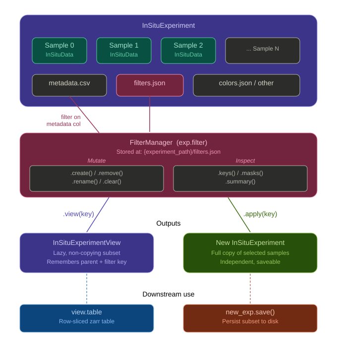

# Metadata-Based Sample Filtering

The `FilterManager` -- accessed via `exp.filters` -- provides a named, persistent filter
layer for `InSituExperiment`. It lets you define boolean masks based on experiment metadata
columns, inspect and compare them as a summary table, and produce subsets of the experiment
as either a lightweight view or a full independent copy. Filters are stored inside the
experiment object and written to disk automatically when you call `exp.save()`.

:::{note}
Filters are persisted automatically to `{experiment_path}/filters.json` whenever
`exp.save()` is called.
:::

## Workflow overview

<center></center>

<br>

The workflow has two output paths once a filter has been created:

1. **View** -- `exp.filters.view(key)` returns an `InSituExperimentView`: a lazy,
   read-only window into the parent experiment containing only the selected samples. No
   data is copied; the view holds a reference back to the parent and re-uses all on-disk
   assets. Views are the right choice for inspection, downstream analysis, and accessing a
   row-sliced zarr table without materialising a new project on disk.
2. **Apply** -- `exp.filters.apply(key)` returns a new, independent `InSituExperiment`
   containing a full in-memory copy of the selected samples. This copy can be modified and
   saved to a new project path with `saveas()`, making it the right choice when you need a
   permanent, stand-alone subset for sharing or further processing.

---

## Setup

```python
from insitupy import InSituExperiment

exp = InSituExperiment.read("path/to/my_experiment")
exp
```

The experiment must have metadata columns to filter on. Inspect the available columns with
`exp.metadata`.

---

## Creating filters

Use `exp.filters.create()` to build a named boolean mask from a metadata column. Exactly
one of `include` or `exclude` must be provided, and the filter must be given a unique
`key`.

**Include by value:**

```python
# Select only samples from the treatment condition
exp.filters.create(
    by="condition",
    include="treatment",
    key="treatment_only",
    note="Samples in the treatment arm",
)
```

**Exclude by value:**

```python
# Exclude samples that failed QC
exp.filters.create(
    by="qc_pass",
    exclude="fail",
    key="high_quality",
    note="Samples that passed QC",
)
```

Both `include` and `exclude` accept a single string or a list of strings when you want to
match multiple values at once. To replace an existing filter with the same key, pass
`overwrite=True`.

```python
exp.filters.create(
    by="condition",
    include=["treatment", "control"],
    key="main_cohort",
    overwrite=True,
)
```

`create()` returns a short confirmation string reporting how many samples were selected,
for example `"Added filter 'high_quality' (8/10 selected)."`.

---

## Inspecting filters

**List stored filter names:**

```python
exp.filters.keys()
# ['treatment_only', 'high_quality', 'main_cohort']
```

**Get a summary table:**

```python
exp.filters.summary()
```

The returned `DataFrame` has columns `filter_key`, `n_selected`, `n_total`,
`n_excluded`, `selected_fraction`, and `note`, giving a quick overview of every filter
and how many samples each one selects.

**Inspect raw boolean masks:**

```python
masks = exp.filters.masks()
# {'treatment_only': [True, False, True, ...], ...}
```

`masks()` returns a dict mapping each filter key to its boolean mask list, with one entry
per row in `exp.metadata`. This is useful for custom logic or for combining masks
manually before passing them elsewhere.

---

## Managing filters

**Rename a filter:**

```python
exp.filters.rename("qc_passed", "high_quality")
```

Pass `overwrite=True` if a filter named `"high_quality"` already exists and you want to
replace it.

**Remove a single filter:**

```python
exp.filters.remove("treatment_only")
```

**Remove all filters:**

```python
exp.filters.clear()
```

None of these operations affects the underlying sample data.

---

## Producing subsets

### `.view(key)` -- lazy, read-only window

```python
view = exp.filters.view("high_quality")
view
```

`view()` returns an `InSituExperimentView`, a subclass of `InSituExperiment` that
delegates all data access to the parent. No files are copied and no new data is loaded.
The view reports itself as a view through `view.is_view` and records which filters were
applied in `view.applied_filters`.

Use a view when you want to inspect or summarise a subset without committing storage,
pass a subset to downstream code that accepts `InSituExperiment`, or access a row-sliced
zarr table without materialising a new project on disk.

### `.apply(key)` -- full independent copy

```python
subset = exp.filters.apply("high_quality")
subset
```

`apply()` returns a new `InSituExperiment` that is a complete in-memory copy of the
selected samples. It is no longer linked to the parent, so modifications to the copy do
not propagate back. Save the copy to a new location with `saveas()`:

```python
subset.saveas("path/to/high_quality_experiment")
```

Use `apply()` when you need a standalone project that can be reloaded independently and
shared with collaborators.

---

## Downstream use of a view

`InSituExperimentView` carries its own `.table` accessor. When the parent experiment has
a concatenated zarr table built with `exp.build_table()`, `view.table` returns a
row-sliced version of that table containing only the cells from the filtered samples:

```python
view = exp.filters.view("high_quality")
view_tbl = view.table
print(f"View covers {view_tbl.n_obs} cells from {len(view.data)} samples")
```

This makes it straightforward to inspect or analyse a subset without rebuilding the full
table. The table access is read-only from the view side; to write analysis results back,
operate on the full parent table and subset afterwards. See {doc}`InSituPy_table_workflow`
for the complete table build-and-import cycle.

---

## Full example

```python
from insitupy import InSituExperiment

# 1. Load experiment
exp = InSituExperiment.read("path/to/my_experiment")

# 2. Create filters
exp.filters.create(
    by="qc_pass",
    exclude="fail",
    key="high_quality",
    note="Samples that passed QC",
)
exp.filters.create(
    by="condition",
    include="treatment",
    key="treatment_only",
    note="Treatment arm only",
)

# 3. Inspect
print(exp.filters.summary())

# 4. Lazy view for quick inspection and table access
view = exp.filters.view("high_quality")
print(f"View: {len(view.data)} samples")
print(f"Table rows: {view.table.n_obs}")

# 5. Full copy for a stand-alone project
subset = exp.filters.apply("high_quality")
subset.saveas("path/to/high_quality_experiment")

# 6. Persist filters to the original experiment
exp.save()
```

---

## API reference

| Method / attribute | Description |
|---|---|
| `exp.filters.create(by, include/exclude, key, note, overwrite)` | Create a named boolean mask from a metadata column |
| `exp.filters.keys()` | List the names of all stored filters |
| `exp.filters.summary()` | DataFrame summarising all filters (n selected, n excluded, fraction, note) |
| `exp.filters.masks()` | Dict mapping each filter key to its boolean mask list |
| `exp.filters.rename(old_key, new_key, overwrite)` | Rename a stored filter |
| `exp.filters.remove(key)` | Delete a stored filter by name |
| `exp.filters.clear()` | Remove all stored filters |
| `exp.filters.view(key)` | Lazy `InSituExperimentView` containing only the selected samples |
| `exp.filters.apply(key)` | New, independent `InSituExperiment` copy of the selected samples |
| `subset.saveas(path)` | Save the copied subset to a new project path |
| `view.table` | Row-sliced zarr table for the samples in the view |

```{eval-rst}
.. seealso::

   :doc:`InSituPy_Anndata_workflow`
       In-memory per-sample AnnData access using ``to_anndata()`` and
       ``import_from_anndata()``.

   :doc:`InSituPy_table_workflow`
       Cross-sample concatenated zarr table: build, analyse, and import results
       back into per-sample objects.
```
