# Cross-Sample Concatenated Table

This tutorial introduces the `.table` attribute on `InSituExperiment`, a zarr-backed
concatenated `AnnData` that spans all samples in an experiment. It enables
memory-efficient access to the full dataset for analysis steps such as
cross-sample clustering, dimensionality reduction, and cell-type annotation —
and provides a clean way to transfer results back to the individual per-sample
objects.

:::{note}
This feature is experimental and may change in future versions.
:::

## Workflow overview

<center></center>

<br>

The workflow has three phases:

1. **Build** — `build_table()` concatenates all per-sample AnnData objects and
   writes the result to `{experiment_path}/tables/concat.zarr`.
2. **Analyse** — access the concatenated table via `.table`, run any scanpy /
   scvi-tools workflow on it, and write the result back to the same zarr store.
3. **Import** — `import_from_table()` transfers selected obs columns and obsm
   keys from the zarr table back into the individual per-sample AnnData objects
   so results are available for spatial visualisation.

This is the zarr-native counterpart to the
{doc}`AnnData workflow <InSituPy_Anndata_workflow>` (`to_anndata()` /
`import_from_anndata()`). The key difference is that `.table` stays on disk
and is read lazily, avoiding the need to hold the full concatenation in RAM
after the analysis step.

---

## Setup

```python
from pathlib import Path
from insitupy import InSituExperiment

# Load a saved experiment (must have a path for build_table to write to)
exp = InSituExperiment.read("path/to/my_experiment")
exp
```

---

## Phase 1: Building the concatenated table

### Basic build (in-memory concatenation)

```python
exp.build_table(
    label_col="uid",           # Metadata column that identifies each sample
    obsm_keys="spatial",       # Keep spatial coordinates (default)
    join="inner",              # Keep only genes shared across all samples
    make_obs_names_unique=True,# Prefix each cell name with "{sample_index}-"
)
```

This creates `{experiment_path}/tables/concat.zarr` and a small sidecar
`tables/build_params.json` that records how the table was built.

### Selecting what to include

Use the `obs_keys`, `var_keys`, `obsm_keys`, and `layer_keys` arguments to
control what is written to the zarr. For example, to include raw counts and
spatial coordinates:

```python
exp.build_table(
    obsm_keys=["spatial"],
    layer_keys=["counts"],     # Include the raw counts layer
    obs_keys="all",            # Include all existing obs columns
    join="inner",
)
```

To add experiment-level metadata columns (e.g. `condition`, `batch`) to
each cell's obs row:

```python
exp.build_table(
    metadata_keys=["condition", "batch"],  # Columns from exp.metadata
    join="inner",
)
```

### Outer join — retain all genes

When samples were measured with different gene panels, use `join="outer"` to
keep all genes across samples (cells from samples without a gene receive `NaN`):

```python
exp.build_table(
    join="outer",
    min_shared_genes=100,      # Warn if fewer than 100 genes are shared
)
```

### Rebuilding an existing table

```python
exp.build_table(overwrite=True)
```

---

## Memory-efficient build with `concat_on_disk`

For large experiments that do not fit in RAM, use
`method="concat_on_disk"`. This mode uses
{func}`anndata.experimental.concat_on_disk` to stream each sample's saved
`table.h5ad` directly to the output zarr store without loading all samples
simultaneously.

**Prerequisites:**
- The experiment must have been saved with `saveas()` (i.e. each
  `InSituData` must have an on-disk path and a saved `cells/` directory).

```python
exp.build_table(
    method="concat_on_disk",
    join="inner",
    make_obs_names_unique=True,
)
```

**Differences from `"in_memory"` mode:**

| Feature | `"in_memory"` | `"concat_on_disk"` |
|---|---|---|
| Obs name prefix | `"{index}-{cell}"` (numeric index) | `"{uid}-{cell}"` (label value) |
| Filter args (`obs_keys`, `var_keys`, …) | Supported | Not supported — raises `ValueError` |
| Metadata columns | Supported | Not supported |
| Requires datasets saved | No | Yes |

---

## Phase 2: Accessing and analysing the table

### Accessing `.table`

```python
tbl = exp.table   # Returns lazily-loaded AnnData (or eager if xarray unavailable)
tbl
```

If `build_table()` has not been called yet, `.table` returns `None` and
emits a `UserWarning`.

### Running a scanpy workflow

The concatenated table is a standard `AnnData` object — any scanpy or
scvi-tools function works directly on it.

```python
import scanpy as sc

tbl = exp.table

# Normalise and log-transform
sc.pp.normalize_total(tbl, target_sum=1e4)
sc.pp.log1p(tbl)

# Dimensionality reduction
sc.pp.highly_variable_genes(tbl, batch_key="uid")
sc.tl.pca(tbl, use_highly_variable=True)
sc.pp.neighbors(tbl, n_neighbors=15, n_pcs=30)
sc.tl.umap(tbl)

# Clustering
sc.tl.leiden(tbl, resolution=0.5, key_added="leiden_integrated")

# Inspect the result
sc.pl.umap(tbl, color=["uid", "leiden_integrated"])
```

### Saving results back to the zarr table

Write any new obs columns or obsm keys back to the zarr store so
`import_from_table()` can read them:

```python
import anndata as ad

zarr_path = Path(exp.path) / "tables" / "concat.zarr"
tbl = ad.read_zarr(zarr_path)          # Load fully into memory

# ... run analysis, e.g. batch correction, clustering ...

tbl.write_zarr(zarr_path)              # Write updated table back to disk
```

---

## Phase 3: Importing results back into per-sample objects

`import_from_table()` reads the zarr table and transfers selected columns/keys
into the individual per-sample `AnnData` objects:

```python
exp.import_from_table(
    obs_columns=["leiden_integrated"],   # Clustering result
    obsm_keys=["X_umap"],               # UMAP embedding
)
```

After importing, call `exp.save()` to persist the changes to disk:

```python
exp.save()
```

Results are now available in every per-sample `InSituData` for spatial
visualisation:

```python
# Plot integrated clusters spatially for sample 0
exp.data[0].cells.table.obs["leiden_integrated"].value_counts()

# Plot UMAP embedding coloured by leiden cluster for the first sample
import scanpy as sc
sc.pl.umap(exp.data[0].cells.table, color="leiden_integrated")
```

---

## Working with filters and views

`InSituExperimentView` — created by `exp.filters.apply()` or direct slicing —
has its own `.table` property that returns a row slice of the parent
experiment's zarr table containing only the samples present in the view:

```python
# Apply a filter defined on the experiment
view = exp.filters.apply("high_quality")

# Access the filtered concatenated table
view_tbl = view.table
print(f"View covers {view_tbl.n_obs} cells from {len(view)} samples")
```

This is read-only: analysing a view's table and writing results back requires
operating on the full parent table and then subsetting.

---

## Full example

```python
from pathlib import Path
import scanpy as sc
import anndata as ad
from insitupy import InSituExperiment

# 1. Load experiment
exp = InSituExperiment.read("path/to/my_experiment")

# 2. Build zarr table (large experiment → use concat_on_disk)
exp.build_table(
    method="concat_on_disk",
    join="inner",
    make_obs_names_unique=True,
)

# 3. Load and analyse
zarr_path = Path(exp.path) / "tables" / "concat.zarr"
tbl = ad.read_zarr(zarr_path)

sc.pp.normalize_total(tbl, target_sum=1e4)
sc.pp.log1p(tbl)
sc.pp.highly_variable_genes(tbl, batch_key="uid")
sc.tl.pca(tbl, use_highly_variable=True)
sc.pp.neighbors(tbl, n_neighbors=15, n_pcs=30)
sc.tl.umap(tbl)
sc.tl.leiden(tbl, resolution=0.5, key_added="leiden_integrated")

# 4. Write results back to zarr
tbl.write_zarr(zarr_path)

# 5. Transfer back to per-sample objects
exp.import_from_table(
    obs_columns=["leiden_integrated"],
    obsm_keys=["X_umap"],
)
exp.save()

# 6. Visualise spatially
sc.pl.umap(exp.table, color=["uid", "leiden_integrated"])
```

---

## API reference

| Method / attribute | Description |
|---|---|
| `exp.build_table(...)` | Build `tables/concat.zarr`; supports `in_memory` and `concat_on_disk` |
| `exp.table` | Lazily load the concatenated AnnData from zarr |
| `exp.import_from_table(obs_columns, obsm_keys)` | Transfer columns/keys from the zarr table back to per-sample objects |
| `view.table` | Row-sliced view of the parent table for the samples in a filter view |

```{eval-rst}
.. seealso::

   :doc:`InSituPy_Anndata_workflow`
       The in-memory counterpart using ``to_anndata()`` and ``import_from_anndata()``.
```
