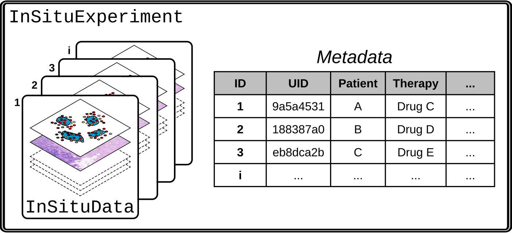

# Multi-sample analysis

This set of tutorials introduces the analysis of multiple samples using **InSituPy**'s `InSituExperiment` class.

<center></center>

<br>

```{eval-rst}
.. card:: Introduction to the `InSituExperiment` class
    :link: InSituPy_InSituExperiment
    :link-type: doc

    Notebook introducing the concepts behind the `InSituExperiment` class to analyze multiple samples.

.. card:: Generating pseudobulk data
    :link: InSituPy_Pseudobulk
    :link-type: doc

    Notebook showing how to generate pseudobulk data from an `InSituExperiment` class.
```

```{toctree}
:hidden: false
:maxdepth: 1

InSituPy_InSituExperiment
InSituPy_Pseudobulk
```