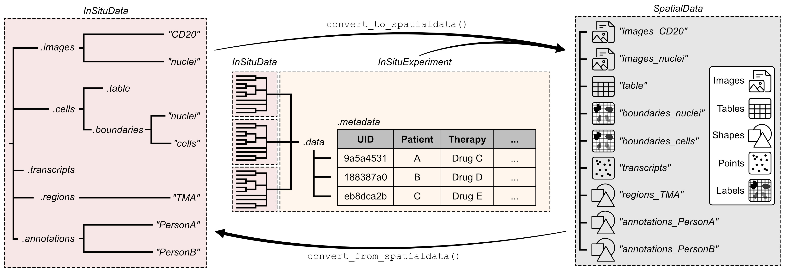

# SpatialData Integration

InSituPy provides bidirectional conversion between its native data formats (`InSituData` and `InSituExperiment`) and the [SpatialData](https://spatialdata.scverse.org/) framework.

<center></center>


## Tutorials

```{eval-rst}
.. card:: Convert InSituPy data to SpatialData
    :link: tutorial_convert_to_spatialdata
    :link-type: doc

    Learn how to convert `InSituData` and `InSituExperiment` objects to the SpatialData format for use with the scverse ecosystem.

.. card:: Convert SpatialData to InSituPy
    :link: tutorial_convert_from_spatialdata
    :link-type: doc

    Learn how to import data from SpatialData format into InSituPy's `InSituData` format for analysis with InSituPy's tools.
```

## Installation

To use the SpatialData integration, you need to install the `spatialdata` package:

```bash
pip install spatialdata
```

For reading data from specific platforms (Xenium, MERSCOPE, etc.), also install:

```bash
pip install spatialdata-io
```

```{toctree}
:hidden: false
:maxdepth: 1
:glob:

*
```
