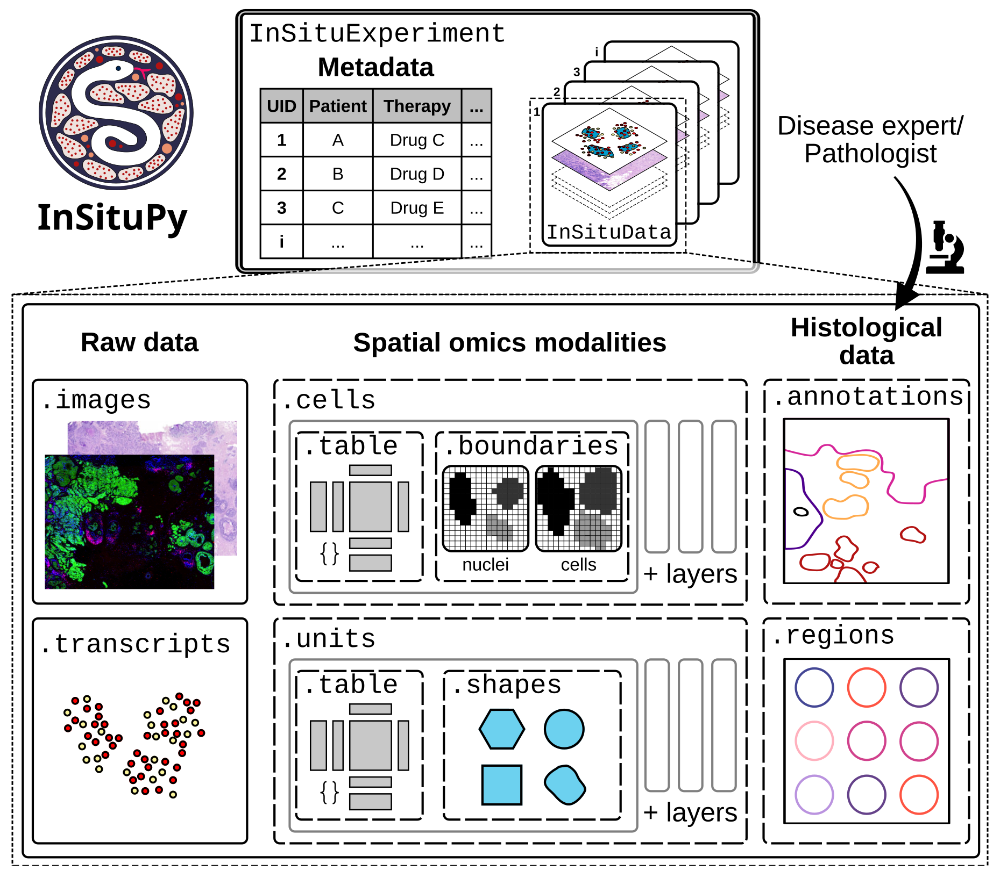

# Tutorials

InSituPy is built around two core classes: **`InSituData`** for analyzing individual spatial transcriptomics samples, and **`InSituExperiment`** for managing multi-sample studies. `InSituData` integrates multiple data modalities—cell expression matrices, transcript locations, tissue images, and spatial annotations—into a unified interface that preserves spatial context throughout your analysis. `InSituExperiment` extends this to collections of samples, connecting each sample to its corresponding metadata, enabling cross-sample comparisons, and coordinated workflows across entire datasets. Together, they provide a complete framework for spatial transcriptomics analysis.

<center></center>

## Topics

To help you get started with **InSituPy**, you can find a collection of different tutorials here. These are divided into the following five topics:

```{eval-rst}
.. card:: Single-sample analysis
    :link: 01_demo_analysis/index
    :link-type: doc
    :link-alt: Analysis demo

    Step-by-step demonstration on how to perform data analysis using `InSituPy` and the `InSituData` class.

.. card:: Multi-sample analysis
    :link: 02_multisample_analysis/index
    :link-type: doc
    :link-alt: Multi-sample analysis tutorials

    This set of tutorials focuses on the analysis of multiple samples using the `InSituExperiment` class.

.. card:: Data import
    :link: 03_data_import/index
    :link-type: doc
    :link-alt: Data import tutorials

    Tutorials explaining how to import data from different technologies or tools.

.. card:: SpatialData Integration
    :link: 07_spatialdata/index
    :link-type: doc
    :link-alt: SpatialData conversion tutorials

    Tutorials for converting between InSituPy and SpatialData formats for integration with the scverse ecosystem.

.. card:: Plotting functionalities
    :link: 04_plotting/index
    :link-type: doc
    :link-alt: Plotting tutorials

    Tutorials introducing different plotting functionalities.

.. card:: Manuscript-related analyses
    :link: 05_publication/index
    :link-type: doc
    :link-alt: Publication-related analyses

    Notebooks including analyses shown in the manuscript.

```


```{toctree}
:hidden: false
:maxdepth: 2

01_demo_analysis/index.md
02_multisample_analysis/index.md
03_data_import/index.md
07_spatialdata/index.md
04_plotting/index.md
05_publication/index.md
```